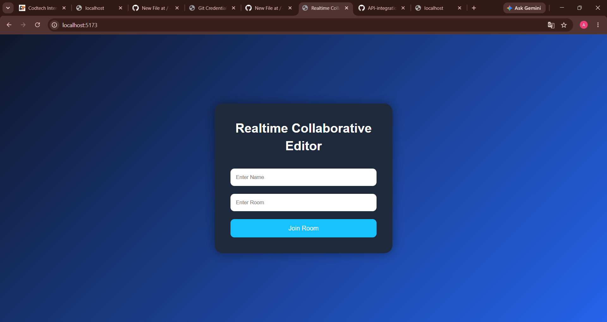

# Realtime Collaborative Editor

**COMPANY:** CODETECH IT SOLUTIONS  
**NAME:** Gannoji Akshaya  
**INTERN ID: CITS1705  
**DOMAIN:** Full Stack Development  
**DURATION:** 4 Weeks  
**MENTOR: Vaishali 

## Introduction

Realtime Collaborative Editor is a web application that allows multiple users to edit documents simultaneously. Changes made by one user are instantly reflected for all connected users using real-time communication.

## Working Principle

1. Users join the editor through a web interface.
2. The frontend captures text changes.
3. Socket.io sends updates to the server.
4. The server broadcasts changes to all connected users.
5. Every user sees updates in real time.

## Technologies Used

- React.js
- Node.js
- Express.js
- Socket.io
- Vite

## Features

- Real-time collaboration
- Multiple user support
- Instant synchronization
- Responsive interface
- Fast communication using WebSockets

## Implementation

The frontend is built using React and Vite. Socket.io-client is used to connect to the backend server. The backend is developed with Node.js and Express, while Socket.io manages real-time communication between users.

## Advantages

- Easy collaboration
- Improved productivity
- Instant updates
- Simple and user-friendly interface

## Future Enhancements

- User authentication
- Document saving
- Rich text editing
- Version history
- File sharing

## Conclusion

Realtime Collaborative Editor demonstrates the power of WebSocket-based communication. It enables multiple users to work together efficiently and provides a foundation for advanced collaborative applications.

## Output

## Output

